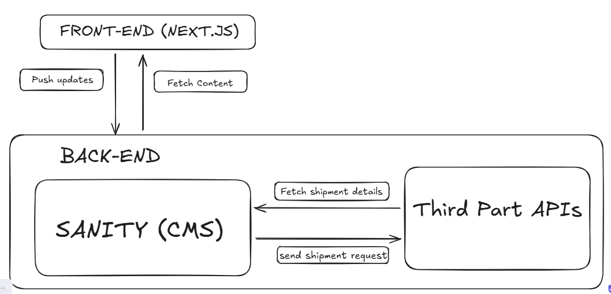

# System Architecture Overview

## Front-end interaction with Sanity CMS and Third Party APIs
The image below shows visual representation of how each component in my system interact with each other. 

## Role of Each Component
### 1. Front-End
- It displays data like products, or order info by fetching data from the backend.
- Handles actions like users clicking on “Place Order”.

### 2. Back-End
- It cordinates all the logics.
- It sends and receives requests from:
  1. Sanity CMS for content (product listings, user profiles, etc.).
  2. Logistics API for delivery updates (e.g., delivery partner gets order details).
  3. Payment API for payment validation and processing.
- It returns processed data to the frontend.

### 3. Sanity
- It structured as schemas.
- It allows your backend to fetch or update content easily via APIs.

### 4. Logistics API (Third-Party)
- When a user places an order, backend sends delivery details (address, product info) to the logistics API.
- Returns delivery updates to the backend (e.g., order dispatched, out for delivery, etc.), which then sends them to the frontend for users.

### 5. Payment API (Third-Party)
- When a user places an order, the payment API validates the credit card/payment info.
- Sends back confirmation to the backend and logs the payment in the system.

# Key Workflows
### 1. Content Fetching (User Browses the Marketplace)
User view products > Frontend requests product > Backend retrieves content from Sanity CMS > Frontend displays the fetched content to the user.

### 2. Order Placement
User clicks 'Order Now' in the frontend > Frontend sends order details to the backend > Backend actions sends order data to Sanity CMS for storage, creates a shipment via Logistics API (returns tracking ID) and processes payment via Payment API > Frontend confirms the order and displays the tracking ID.

### 3. Order Tracking
User clicks Track My Order in the frontend > Frontend sends tracking request to backend >Backend fetches status from Logistics API (e.g., "Out for delivery") > Frontend displays shipment status to the user.
